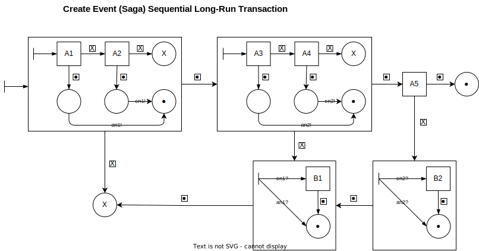

# Intoduction

TBD

## Compositional Patterns for Long–running Transactions

TBD

### Sequential Transactions

Activities A1,... ,An composing a sequential transaction are assumed 
to be executed sequentially, namely, when activity Ai is committed, 
activity Ai+1 starts its execution. Compensation activities B1,... ,
Bn are associated with each activity Ai. Transactions of this kind must 
be guaranteed that either the entire sequence A1,... ,An is executed or 
the compensated sequence A1,... ,Ai,Bi,... ,B1 
is executed for some i < n.

# Saga Definitions

## Create Event Saga

TBD

### Sequential Transaction definition

$A$ = [[$A'$┌►$B'$ $\cdot$ $A''$┌►$B''$ $\cdot$ A5]]_S_
= $\langle$($\emptyset$,$\emptyset$,{s$'$,s$''$,s5,s$'''$},{s$'$,s$''$,s$'''$,s5,q0,$\odot,\otimes$},q0,$\delta$),$\mu$$\rangle$ 
_with_ $\delta$ = {(q0,$\tau$,true,$\emptyset$,s$'$),(s$'$,$\boxed{\cdot}$,s$''$),(s$'$,$\boxed{\times},\otimes$),(s$''$,$\boxed{\cdot}$,s5),(s$''$,$\boxed{\times}$,s$''''$),(s5,$\boxed{\cdot}$,$\odot$),(s5,$\boxed{\times}$,s$'''$),(s$'''$,$\boxed{\cdot}$,s$''''$)} 
$\mu$={($A'$,s$'$),($A''$,s$''$),(A5,s5),($B''$,s$'''$),($B'$,s$''''$)}

$A'$ = [[A1 $\cdot$ A2┌►$B'$]]_S_ 
= $\langle$({{an1!,cn1!},$\emptyset$,{s1,s2},{s1,s2,q0,q1,q2,$\odot,\otimes$},q0,$\delta'$},$\mu'$)$\rangle$  
_with_ $\delta'$= {(q0,$\tau$,true,$\emptyset$,s1),(s1,$\boxed{\cdot}$,q1),(q1,an1!,true,$\emptyset$,$\odot$),(s1,$\boxed{\times}$,s2), (s2,$\boxed{\cdot}$,q2),(s2,$\boxed{\times}$,$\otimes$),(q2,cn1!,true,$\emptyset$,$\odot$)) 
$\mu'$ = {(A1,s1),(A2,s2)}

$A''$ = [[A3 $\cdot$ A4┌►$B''$]]_S_ 
= $\langle$({{an2!,cn2!},$\emptyset$,{s3,s4},{s3,s4,q0,q3,q4,$\odot,\otimes$},q0,$\delta''$},$\mu''$)$\rangle$  
_with_ $\delta''$ = {(q0,$\tau$,true,$\emptyset$,s3),(s3,$\boxed{\cdot}$,q3),(q3,an2!,true,$\emptyset$,$\odot$),(s3,$\boxed{\times}$,s4), (s4,$\boxed{\cdot}$,q4),(s4,$\boxed{\times}$,$\otimes$),(q4,cn2!,true,$\emptyset$,$\odot$)) 
$\mu''$ = {(A3,s3),(A4,s4)}

$B''$ = [[B2]]_S__C_ 
= $\langle$({{an2?,cn2?},$\emptyset$,{s6},{s6,q0,$\odot$},q0,$\delta'''$},$\mu'''$)$\rangle$  
_with_ $\delta'''$ = {(q0,an2?,true,$\emptyset$,$\odot$),(q0,cn2?,true,$\emptyset$,s6),(s6,$\boxed{\cdot}$,$\odot$)} 
$\mu'''$ = {(B2,s6)}

$B'$ = [[B1]]_S__C_ 
= $\langle$({{an1?,cn1?},$\emptyset$,{s7},{s7,q0,$\odot$},q0,$\delta''''$},$\mu''''$)$\rangle$  
_with_ $\delta''''$ = {(q0,an1?,true,$\emptyset$,$\odot$),(q0,cn1?,true,$\emptyset$,s7),(s7,$\boxed{\cdot}$,$\odot$)} 
$\mu''''$ = {(B1,s7)}

_States:_ 
q0 ::= _Initial_ 
q1 ::= _Calendar exists and data was received, no compensation action is needed_ 
q2 ::= _Calendar doesn't exist and new record was created, the compensation action is needed_ 
q3 ::= _Event Group exists and data was received, no compensation action is needed_ 
q4 ::= _Event Group doesn't exist and new record was created, the compensation action is needed_ 
s1 ::= _Tryint to get exist Calendar by (Name, Year)_ 
s2 ::= _Trying to add a new Calendar record_ 
s3 ::= _Tryint to get exist Event Group by (Name)_ 
s4 ::= _Trying to add a new Event Group record_ 
s5 ::= _Trying to add a new Event record_ 
s6 ::= _Trying to remove added Event Group record (compensation action for A4)_ 
s7 ::= _Trying to remove added Calendar record (compensation action for A2)_ 

